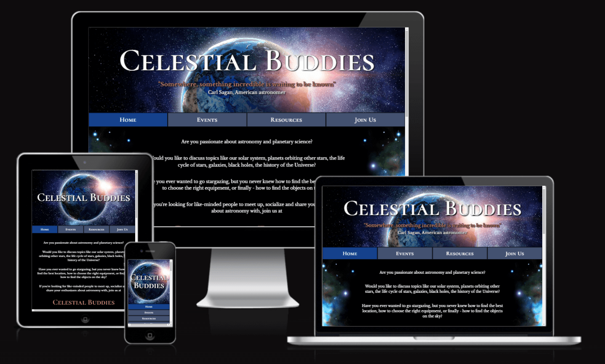

# Celestial Buddies Website

Celestial Buddies website is a website provided for a local, amateur astronomy club. It contains basic information for potential members, who may be intrested in joining in for a regular monthly meetups or stargazing events. It also provides information on bigger events organised by the club like day trips and workshops, resources that may be useful for astronomy enthusiasts, and links to additional social media accounts used by the club. The site is comprised of four pages: Home, Events, Resources and Join Us.

Are you interested in astronomy and planetary science? Why don't you take a look at Celestial Buddies' deployed website? [Celestial Buddies Website](https://nataliaczeladka.github.io/celestial-buddies/)

## User Experience (UX)

### User Stories

- Client Goals
  - To have an online presence.
  - To create a welcoming and inclusive community, where people of all skill levels can come together to learn about the wonders of the Universe.
  - To provide educational opportunities that attract both beginners and experienced astronomy enthusiasts through various types of activities like regular meetups, workshops, stargazing sessions, day trips etc.
  - To inspire a passion for astronomy and space exploration by providing resources for self-study.
  - To describe it all briefly on the website, including information about times and locations of the meetups, contact details, social media links.
  - To attract potential members by providing it all in a form of a visually appealing, intuitive, responsive across different devices and easy to navigate website.

- First Time User Goals
  - To navigate throught the page in an easy, effortless and intuitive way.
  - To understand the club's main purpose, its mission and values.
  - To quickly locate relevant information like learning resources, upcoming events etc.
  - To learn about various types of activities available for club's members.
  - To find the club's social media links in order to determine how trusted and known they are.
  - To be able to sign up for a membership in a quick and easy way.
  - To have a positive and enjoyable experience while browsing the website.

- Returning User Goals
  - To find the best way to get in contact with the club's members or to sign up.
  - To locate information about times and locations of the meetups.
  - To access their social media.

- Frequent User Goals
  - To easily find the latest information and updates e.g., upcoming events, new learning resources.
  - To easily find and revisit user's favourite content.
  - To access community and to get in touch with other members - feature available in the future when the site expands.

## Design

### Colour Scheme

The colour scheme chosen for the Celestial Buddies website combines the timeless elegance of black and white with subtle shades of blue and the deep, warm shade of brown called burnt sienna. These colours are commonly assosiated with the beauty of the night sky. The use of black and white may bring to mind the vastness of the cosmos, while the blue tones add depth and tranguility of the Universe.

