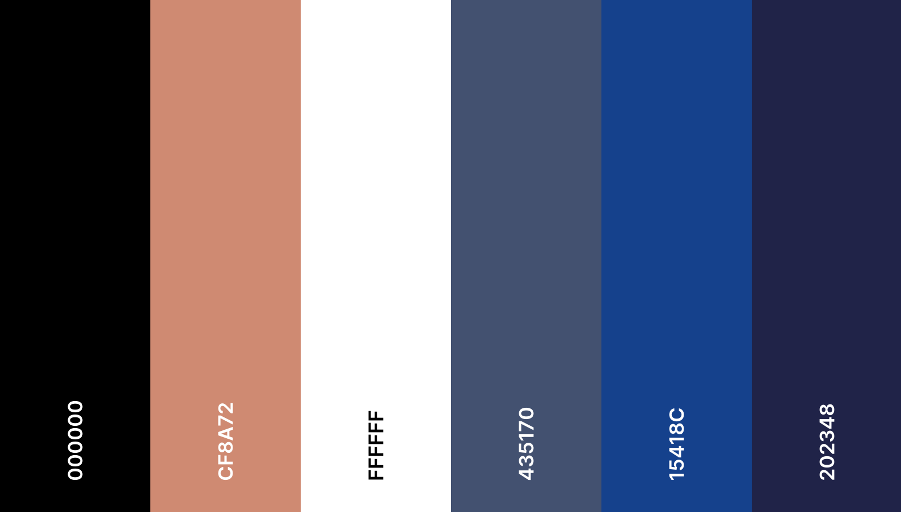
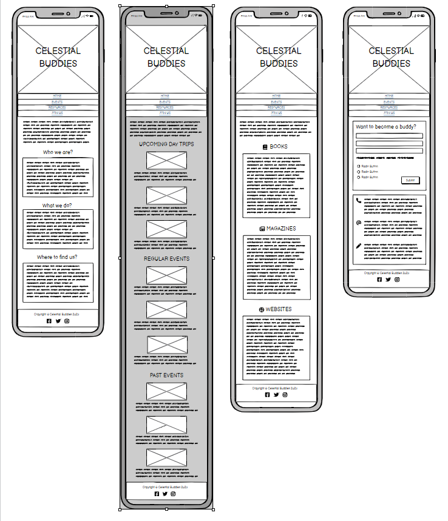
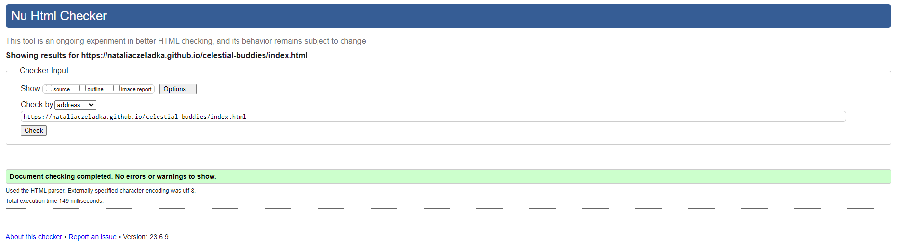
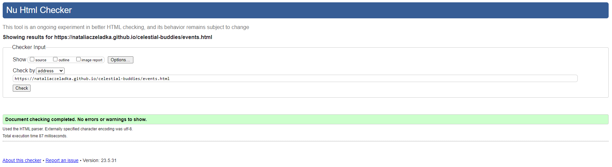
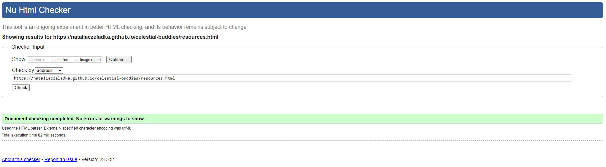
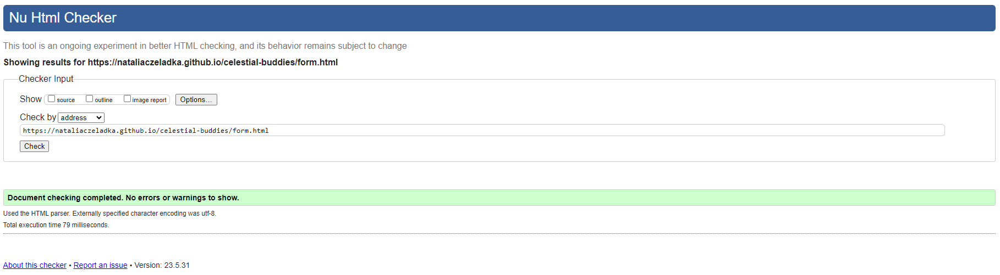
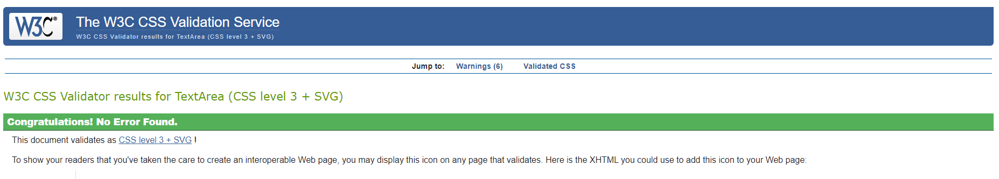

# Celestial Buddies Website

The Celestial Buddies website is a website provided for a local, amateur astronomy club. It contains basic information for potential members, who may be interested in joining in for a regular monthly meetups or stargazing events. It also provides information on bigger events organised by the club like day trips and workshops, resources that may be useful for astronomy enthusiasts, and links to additional social media accounts used by the club. The site is comprised of four pages: Home, Events, Resources and Join Us.

Are you interested in astronomy and planetary science? Why don't you take a look at Celestial Buddies' deployed website? [Celestial Buddies Website](https://nataliaczeladka.github.io/celestial-buddies/)

## Table of Contents

- [Celestial Buddies Website](#celestial-buddies-website)
  - [Table of Contents](#table-of-contents)
  - [User Experience (UX)](#user-experience-ux)
    - [User Stories](#user-stories)
      - [Client Goals](#client-goals)
      - [First Time User Goals](#first-time-user-goals)
      - [Returning User Goals](#returning-user-goals)
      - [Frequent User Goals](#frequent-user-goals)
  - [Design](#design)
    - [Colour Scheme](#colour-scheme)
    - [Typography](#typography)
    - [Imagery](#imagery)
    - [Wireframes](#wireframes)
  - [Technologies Used](#technologies-used)
    - [Languages Used](#languages-used)
    - [Frameworks, Libraries and Programs Used](#frameworks-libraries-and-programs-used)

## User Experience (UX)

### User Stories

#### Client Goals

- To have an online presence.
- To create a welcoming and inclusive community, where people of all skill levels can come together to learn about the wonders of the Universe.
- To provide educational opportunities that attract both beginners and experienced astronomy enthusiasts through various types of activities like regular meetups, workshops, stargazing sessions, day trips etc.
- To inspire a passion for astronomy and space exploration by providing resources for self-study.
- To describe it all briefly on the website, including information about times and locations of the meetups, contact details, social media links.
- To attract potential members by providing it all in a form of a visually appealing, intuitive, responsive across different devices and easy to navigate website.

#### First Time User Goals

- To navigate throughout the page in an easy, effortless and intuitive way.
- To understand the club's main purpose, its mission and values.
- To quickly locate relevant information like learning resources, upcoming events etc.
- To learn about various types of activities available for club's members.
- To find the club's social media links in order to determine how trusted and known they are.
- To be able to sign up for a membership in a quick and easy way.
- To have a positive and enjoyable experience while browsing the website.

#### Returning User Goals

- To find the best way to get in contact with the club's members or to sign up.
- To locate information about times and locations of the meetups.
- To access their social media.

#### Frequent User Goals

- To easily find the latest information and updates e.g., upcoming events, new learning resources.
- To easily find and revisit user's favourite content.
- To access community and to get in touch with other members - feature available in the future when the site expands.

## Design

### Colour Scheme

The colour scheme chosen for the Celestial Buddies website combines the timeless elegance of black and white with subtle shades of blue and the deep, warm shade of brown called burnt sienna. These colours are commonly assosiated with the beauty of the night sky. The use of black and white may bring to mind the vastness of the cosmos, while the blue tones add depth and tranguility of the Universe.

### Typography

To emphasize the contrast between main headings and paragraphs, I have carefully selected two different fonts. They are both Google Fonts and they are both Serif, but this is where similarities end. The fonts were paired in the way that enhances the visual hierarchy of the website and highlights essential information.

- The [Libre Baskerville](https://fonts.google.com/specimen/Libre+Baskerville?query=libre) font is the main font used throughout the whole website with Serif as the fallback font. It's a clean and legible font that ensures easy readability. It was mainly used to provide text content to the paragraphs.

- The [Cormorant SC](https://fonts.google.com/specimen/Cormorant+SC?query=cormorant+) font was used for nearly all of the main headings, navigational bar and the footer. It's a bold and eye-catching font that easily draws attention, perfect for the main title of the website.

### Imagery

Imagery plays a vital role in capturing the awe-inspiring beauty of the cosmos on the Celestial Buddies website. Its main purpose is to inspire and immerse visitors in the captivating word of astronomy, and to encourage them to expand their knowledge on this topic.

The images used on the website were sourced from three leading providers of stock photography: [Shutterstock](https://www.shutterstock.com/), [Pexels](https://www.pexels.com/) and [Unsplash](https://unsplash.com/).

### Wireframes

Wireframes were created using [Balsamiq](https://balsamiq.com/wireframes/) - the industry top wireframing software.

## Technologies Used

### Languages Used

- HTML5 - to format, arrange and display the website content.
- CSS3 - to define colour, size and position of HTML elements.

### Frameworks, Libraries and Programs Used

- [Am I responsive?](https://ui.dev/amiresponsive) - used to check the site's responsiveness and to create mockups.
- [Balsamiq](https://balsamiq.com/wireframes/) - used to create mobile, tablet and desktop wireframes.
- [Bootstrap v5.3](https://getbootstrap.com/) - used to assist with responsiveness by utilizing its layout elements.
- [CodeAnywhere](https://app.codeanywhere.com/) - used as cloud IDE to write, edit and save the code.
- [Coolors](https://coolors.co/) - used to create the colour palette.
- [Font Awesome](https://fontawesome.com/) - used to provide icons across the website.
- [Google Chrome Dev Tools](https://developer.chrome.com/docs/devtools/) - used to inspect and debug the code.
- [Google Fonts](https://fonts.google.com/) - used to import the fonts that style all of the text content.
- [Git](https://git-scm.com/) - used for version control by utilizing CodeAnywhere's terminal.
- [GitHub](https://github.com/) - used to store the project's code and images i
n the repository.
- [GitHub Pages](https://pages.github.com/) - used to deploy the website.
- [Tiny.png](https://tinypng.com/) - used to reduce the size of the image files.

## Testing

### Code Validation

The W3C Markup Validator and W3C CSS Validator were used to validate every page of the project to ensure there were no syntax errors.

#### HTML Validation

The [W3C Markup Validation Service](https://validator.w3.org/) was used to validate all four HTML files. No errors or warnings were found.

#### CSS Validation

The [W3C CSS Validation Service](https://jigsaw.w3.org/css-validator/) was used to validate the CSS stylesheet. No errors were found.

