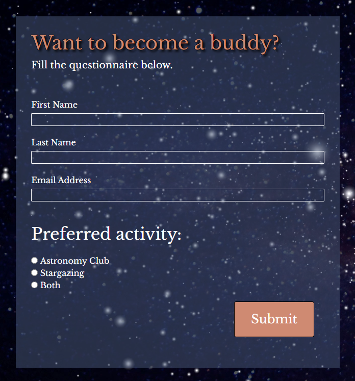

# Celestial Buddies Website

The Celestial Buddies website is a website provided for a local, amateur astronomy club. It contains basic information for potential members, who may be interested in joining in for a regular monthly meetups or stargazing events. It also provides information on bigger events organised by the club like day trips and workshops, resources that may be useful for astronomy enthusiasts, and links to additional social media accounts used by the club. The site is comprised of four pages: Home, Events, Resources and Join Us.

Are you interested in astronomy and planetary science? Why don't you take a look at Celestial Buddies' deployed website? [Celestial Buddies Website](https://nataliaczeladka.github.io/celestial-buddies/)

## Table of Contents

- [Celestial Buddies Website](#celestial-buddies-website)
  - [Table of Contents](#table-of-contents)
  - [User Experience (UX)](#user-experience-ux)
    - [User Stories](#user-stories)
      - [Client Goals](#client-goals)
      - [First Time User Goals](#first-time-user-goals)
      - [Returning User Goals](#returning-user-goals)
      - [Frequent User Goals](#frequent-user-goals)
  - [Design](#design)
    - [Colour Scheme](#colour-scheme)
    - [Typography](#typography)
    - [Imagery](#imagery)
    - [Wireframes](#wireframes)
    - [Features](#features)
      - [Exisiting Features](#exisiting-features)
      - [Future Features](#future-features)
  - [Technologies Used](#technologies-used)
    - [Languages Used](#languages-used)
    - [Frameworks, Libraries and Programs Used](#frameworks-libraries-and-programs-used)
  - [Testing](#testing)
  - [Deployment](#deployment)
    - [Deploying the project to GitHub Pages](#deploying-the-project-to-github-pages)
    - [Forking the GitHub repository](#forking-the-github-repository)
    - [Making a local clone](#making-a-local-clone)
  - [Credits](#credits)
    - [Code](#code)
    - [Content](#content)
    - [Media](#media)
    - [Acknowledgements](#acknowledgements)

## User Experience (UX)

### User Stories

#### Client Goals

- To have an online presence.
- To have a website that will help me create a welcoming and inclusive community, where people of all skill levels can come together to learn about the wonders of the Universe.
- To provide educational opportunities that attract both beginners and experienced astronomy enthusiasts through various types of activities like regular meetups, workshops, stargazing sessions, day trips etc.
- To inspire a passion for astronomy and space exploration by providing resources for self-study.
- To describe it all briefly on the website, including information about times and locations of the meetups, contact details, social media links.
- To attract potential members by providing it all in a form of a visually appealing, intuitive, responsive across different devices and easy to navigate website.

#### First Time User Goals

- To navigate throughout the page in an easy, effortless and intuitive way.
- To understand the club's main purpose, its mission and values.
- To quickly locate relevant information like learning resources, upcoming events etc.
- To learn about various types of activities available for the club members.
- To find the club social media links in order to determine how trusted and known they are.
- To be able to sign up for a membership in a quick and easy way.
- To have a positive and enjoyable experience while browsing the website.

#### Returning User Goals

- To find the best way to get in contact with the club members or to sign up.
- To locate information about times and locations of the meetups.
- To access their social media accounts.

#### Frequent User Goals

- To easily find the latest information and updates e.g., upcoming events, new learning resources.
- To easily find and revisit user's favourite content.
- To access community and to get in touch with other members.

## Design

### Colour Scheme

The colour scheme chosen for the Celestial Buddies website combines the timeless elegance of black and white with subtle shades of blue and the deep, warm shade of brown called burnt sienna. These colours are commonly assosiated with the beauty of the night sky. The use of black and white may bring to mind the vastness of the cosmos, while the blue tones add depth and tranguility of the Universe.

I used [Coolors](https://coolors.co/cf8a72-000000-ffffff-435170-15418c-202348) to generate my colour palette.

### Typography

To emphasize the contrast between main headings and paragraphs, I have carefully selected two different fonts. They are both Google Fonts and they are both Serif, but this is where similarities end. The fonts were paired in the way that enhances the visual hierarchy of the website and highlights essential information.

- The [Libre Baskerville](https://fonts.google.com/specimen/Libre+Baskerville?query=libre) font is the main font used throughout the whole website with Serif as the fallback font. It's a clean and legible font that ensures easy readability. It was mainly used to provide text content to the paragraphs.

- The [Cormorant SC](https://fonts.google.com/specimen/Cormorant+SC?query=cormorant+) font was used for nearly all of the main headings, navigational bar and the footer. It's a bold and eye-catching font that easily draws attention, perfect for the main title of the website.

[Font Awesome](https://fontawesome.com/) icons were used throughout the site, such as the social media icons in the footer.

### Imagery

Imagery plays a vital role in capturing the awe-inspiring beauty of the cosmos on the Celestial Buddies website. Its main purpose is to inspire and immerse visitors in the captivating word of astronomy, and to encourage them to expand their knowledge on this topic.

The images used on the website were sourced from three leading providers of stock photography: 

- [Shutterstock](https://www.shutterstock.com/),
- [Pexels](https://www.pexels.com/),
- [Unsplash](https://unsplash.com/).

### Wireframes

Wireframes were created using [Balsamiq](https://balsamiq.com/wireframes/) - the industry top wireframing software.

| Size | Screenshot |
| --- | --- |
| Mobile |  |
| Tablet |  |
| Desktop |  |

### Features

#### Exisiting Features

The Celestial Buddies website consists of four pages: Home, Events, Resources and Join Us.

Some features are common for all of them. These are:

- Page Header - It's comprised of the breathtaking image of the planet Earth, the main page title (which is also the astronomy club's name) and the inspiring quote by Carl Sagan (American astronomer). It appears on the top of every page within the website. Its purpose is to encourage users to expand their knowledge about the wonders of the Universe.
  

- Navigation Bar - It stretches across the entire width of the screen. It consists of links to all four pages of the website. It was created using Flexbox and it's fully responsive. The active tab has a different colour than the other three. The tab font colour changes to black when a user hovers over it.
  

- Page Footer - It also stretches across the entire width of the screen. It consists of copyright information on the left side, and social media links on the right side. It was created using Bootstrap's `container-fluid`. Social media icons change their colour to black when a user hovers over them.

Home Page consists of:

- Intoduction - There are a few direct questions there addressed to a user of the website. Their main purpose is to check if the astronomy club is something they would be interested in. It's all placed between two images that mirror each other.

- Basic Information - This section is comprised of three columns. Each of them is the answer to the question placed above them. These three questions are: Who we are? What we do? Where to find us? This section provides information on times and locations of the meetups. It also briefly describes the group's characteristics, interests and types of activities they provide.

Events Page consists of:

- Introduction - Just a few short paragraphs with a very simple styling (white font on the black background), explaining what kind of events are available for the club members.

- Upcoming Day Trips Section - This section is comprised of three columns. Every column has an image on the top, a location of a trip right below it, and a short description at the bottom.

- Regular Events Section - It's also comprised of three columns. Every column has an image on the top, a location of a regular event right below it, and a short description at the bottom.

- Past Events Section - Like the previous two sections, it's comprised of three columns. Every column has an image on the top, a name of a past event right below it, and a short description at the bottom.

Resources Page consists of:

- Introduction - Just a few short paragraphs with a very simple styling (white font on the black background), explaining what kind of resources can be found in this section.

- Resources Section - This section is comprised of three columns. They provide a diverse range of materials for self-study, grouped into books, magazines and websites. The list is far from exhaustive and will be regularly updated.

Join Us Page consists of:

- Join Us Form - It's comprised of three text inputs, three radio buttons and the submit button. It allows users to join Celestial Buddies and to specify their preferred activities.

- Contact Information Section - It provides phone numbers, email address and locations of the club's regular meetups and stargazing sessions.

  
#### Future Features

- Bootstrap's badges - to indicate a new content added to the website (to meet the first frequent user goal).
  
- The sign-up/login feature - which will allow users to access information and resources available only to the club members. It will also allow members to tag their favourite content and come back to it later (to meet the second frequent user goal).

- Community Section - for the club members to interact, to discuss their ideas and share their resources (to meet the third frequent user goal).

## Technologies Used

### Languages Used

- [HTML](https://en.wikipedia.org/wiki/HTML) - used for the main site content.
- [CSS](https://en.wikipedia.org/wiki/CSS) - used for the main site design and layout.

### Frameworks, Libraries and Programs Used

- [Balsamiq](https://balsamiq.com/wireframes/) - used to create mobile, tablet and desktop wireframes.
- [Bootstrap v5.3](https://getbootstrap.com/) - used to assist with responsiveness by utilizing its layout elements.
- [CodeAnywhere](https://app.codeanywhere.com/) - used as cloud IDE to write, edit and save the code.
- [Coolors](https://coolors.co/) - used to create the colour palette.
- [Font Awesome](https://fontawesome.com/) - used to provide icons across the website.
- [Free Convert](https://www.freeconvert.com/jpg-to-webp) - used to convert jpg images to webp format.
- [Google Chrome Dev Tools](https://developer.chrome.com/docs/devtools/) - used to inspect and debug the code.
- [Google Fonts](https://fonts.google.com/) - used to import the fonts that style all of the text content.
- [Git](https://git-scm.com/) - used for version control by utilizing CodeAnywhere's terminal.
- [GitHub](https://github.com/) - used to store the project's code and images in the repository.
- [GitHub Pages](https://pages.github.com/) - used to deploy the website.
- [Techsini](http://techsini.com/multi-mockup/) - used to check the site's responsiveness and to create mockups.
- [Tiny.png](https://tinypng.com/) - used to reduce the size of the image files.

## Testing

For all testing, please refer to the [TESTING.md](TESTING.md) file.

## Deployment

### Deploying the project to GitHub Pages

1. Log in to your GitHub account and locate the repository you would like to deploy.
2. Navigate to the "Settings" tab at the top of your selected repository.
3. Select "Pages" from the menu on the left-hand side of the screen.
4. Make sure the "Select" dropdown menu shows "Deploy from a branch".
5. From the "Branch" dropdown menu select "Main" and click "Save".
6. The page will automatically refresh and display the link to your deployed website.

### Forking the GitHub repository

By forking the repository, you make a copy of the original repository on your GitHub account to view or to make changes to, without affecting the original repository.

1. Log in to your GitHub account and locate the repository you would like to fork.
2. At the top of the repository on the right-hand side of the screen, locate the "Fork" button.
3. After clicking on it, you should have your own copy of the original repository in your GitHub account.

### Making a local clone

Making a clone is basically making a copy of the selected repository.

1. Log in to your GitHub account and locate the repository you would like to clone.
2. Click on the "Code" button just under the repository name.
3. Copy the HTTPS link from the website address bar.
4. Open a GitBash terminal and locate the directory where you want to place the clone.
5. Type 'git clone' and then paste the URL you copied earlier.
6. Press enter. Then your local clone will be created.

## Credits

### Code

- Code for the outline effect used on a multiple occasions across the CSS stylesheet was taken from [Stack Overflow](https://stackoverflow.com/questions/4919076/outline-effect-to-text) and got slightly edited to fit the project needs.

Screenshot of the post:

- Code for non-breaking space, needed to always keep "Join" and "Us" together in the last tab of the navigation bar, was taken from [W3Schools](https://www.w3schools.com/html/html_entities.asp).

Screenshot of the article:

- [Bootstrap v5.3](https://getbootstrap.com/) - Bootstrap's 'container-fluid' was used throughout the project to make the site responsive.

### Content

- [The National Space Centre's Website](https://www.spacecentre.co.uk/) - information contained in the "Upcoming Day Trips" section of the "Events" page.
- [The Royal Observatory's Website](https://www.rmg.co.uk/royal-observatory) - information contained in the "Upcoming Day Trips" section of the "Events" page.
- [The Science Museum's Website](https://www.sciencemuseum.org.uk/) - information contained in the "Upcoming Day Trips" section of the "Events" page.
- [The European AstroFest's Website](https://europeanastrofest.com/) - information contained in the "Regular Events" section of the "Events" page.
- [English Heritage Webiste](https://www.english-heritage.org.uk/visit/places/stonehenge/) - information about Stonehenge contained in the "Regular Events" section of the "Events" page.
- [The Practical Astronomy Show's Website](https://practicalastroshow.com/) - information contained in the "Past Events" section of the "Events" page.
- [The European Space Agency's Website](https://www.esa.int/) - information contained in the "Past Events" section of the "Events" page.
- ["Meet a NASA engineer" Video](https://www.youtube.com/watch?v=jUMDVncHNes) - information contained in the "Past Events" section of the "Events" page.
- ["Best Space and Astronomy Books 2023" Article](https://www.space.com/32982-best-astronomy-books.html) - the list of books contained in the "Books" section of the "Resources" page.
- ["Top 20 Astronomy Magazines and Publications" Article](https://blog.feedspot.com/astronomy_magazines/) - the list of magazines contained in the "Magazines" section of the "Resources" page.
- ["10 Amazing Astronomy Websites to Get to Know the Universe" Article](https://www.makeuseof.com/tag/universe-amazing-astronomy-websites/) - the list of websites contained in the "Websites" section of the "Resources" page.
- ["The 10 Best Astronomy Apps for Enjoying the Night Sky" Article](https://www.makeuseof.com/tag/great-android-astronomy-apps/) - the list of astronomy apps contained in the "Websites" section of the "Resources" page.

### Media

The images used on the website were sourced from three leading providers of stock photography: 

- [Shutterstock](https://www.shutterstock.com/),
- [Pexels](https://www.pexels.com/),
- [Unsplash](https://unsplash.com/).

### Acknowledgements

- [Tim Nelson](https://github.com/TravelTimN) (my Code Institute mentor) - for sharing his impressive knowledge, for his guidance, constructive feedback, understanding, and always finding a kind word of comfort when things were getting complicated and I felt incompetent and overwhelmed.
- [Callum Jones](https://www.linkedin.com/in/callum-jones-9b80941b8/) (Newcastle College cohort facilitator) - for his helpful advice and continuous encouragement throughout the creation of my website.
- [Code Institute](https://codeinstitute.net) Tutor Support Team - for their assistance with troubleshooting and debugging some project issues.
- [Code Institute Slack Community](https://code-institute-room.slack.com) - for the moral support; it kept me going during periods of self doubt and imposter syndrome.
