# Testing

Return back to the [README.md](README.md) file.

## Table of Contents

- [Testing](#testing)
  - [Table of Contents](#table-of-contents)
  - [Code Validation](#code-validation)
    - [HTML Validation](#html-validation)
    - [CSS Validation](#css-validation)
  - [Browser Compatibility](#browser-compatibility)
  - [Responsiveness](#responsiveness)
  - [Lighthouse Audit](#lighthouse-audit)
  - [User Stories Testing](#user-stories-testing)
    - [Client Goals](#client-goals)
    - [First Time User Goals](#first-time-user-goals)
    - [Returning User Goals](#returning-user-goals)
    - [Frequent User Goals](#frequent-user-goals)
  - [Fixed Bugs](#fixed-bugs)
  - [Unfixed Bugs](#unfixed-bugs)

## Code Validation

[The W3C Markup Validation Service](https://validator.w3.org/) and [The W3C CSS Validation Service](https://jigsaw.w3.org/css-validator/) were used to validate every page of the project to ensure there were no syntax errors. The results clearly showed that the website stays in compliance with the standards and recommendations set by the World Wide Web Consortium.

### HTML Validation

I have used the recommended [HTML W3C Validator](https://validator.w3.org) to validate all of my HTML files. No errors or warnings were found.

| Page | W3C URL | Screenshot | Notes |
| --- | --- | --- | --- |
| Home | [W3C](https://validator.w3.org/nu/?doc=https%3A%2F%2FNataliaCzeladka.github.io%2Fcelestial-buddies%2Findex.html) | 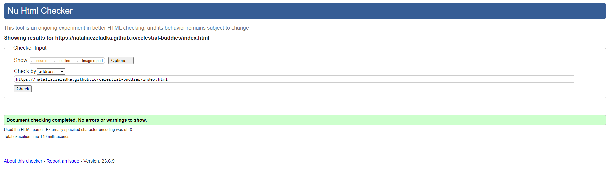 | Pass: No Errors |
| Events | [W3C](https://validator.w3.org/nu/?doc=https%3A%2F%2FNataliaCzeladka.github.io%2Fcelestial-buddies%2Fevents.html) | 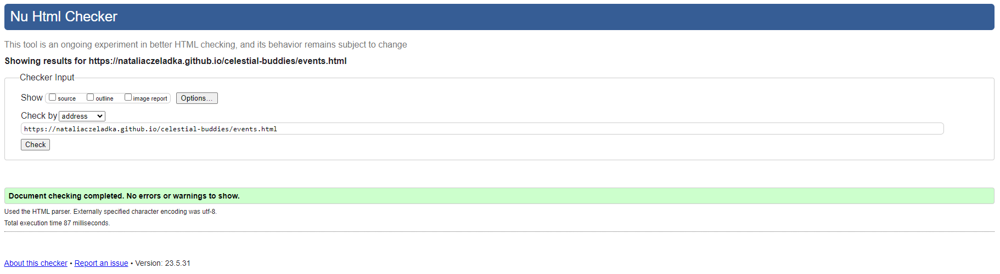 | Pass: No Errors |
| Resources | [W3C](https://validator.w3.org/nu/?doc=https%3A%2F%2FNataliaCzeladka.github.io%2Fcelestial-buddies%2Fresources.html) | 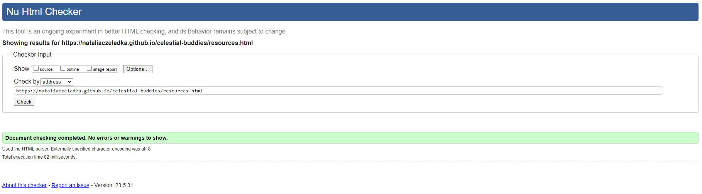 | Pass: No Errors |
| Form | [W3C](https://validator.w3.org/nu/?doc=https%3A%2F%2FNataliaCzeladka.github.io%2Fcelestial-buddies%2Fform.html) | 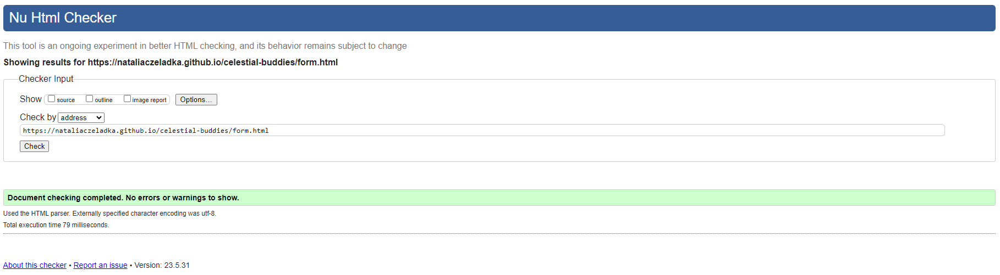 | Pass: No Errors |

### CSS Validation

I have used the recommended [CSS Jigsaw Validator](https://jigsaw.w3.org/css-validator) to validate my CSS file. No errors were found.

| File | Jigsaw URL | Screenshot | Notes |
| --- | --- | --- | --- |
| style.css | [Jigsaw](https://jigsaw.w3.org/css-validator) | 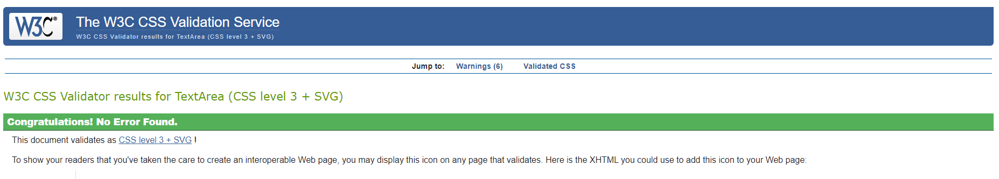 | Pass: No Errors |

## Browser Compatibility

I have tested my deployed project on multiple browsers to check for compatibility issues.

| Browser | Screenshot | Notes |
| --- | --- | --- |
| Chrome | 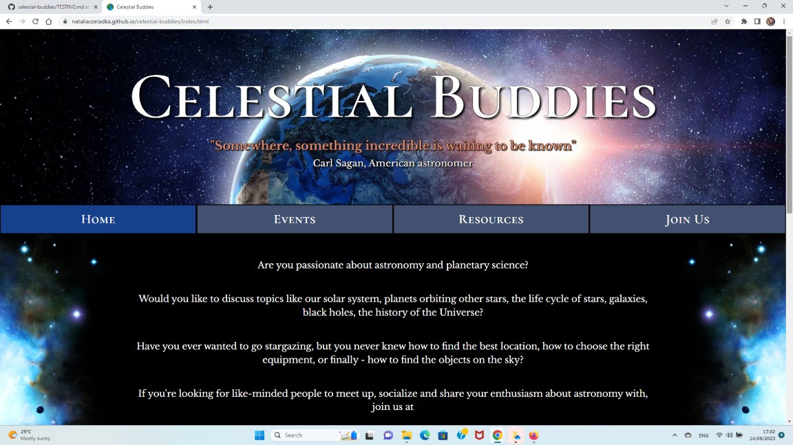 | Works as expected |
| Firefox | 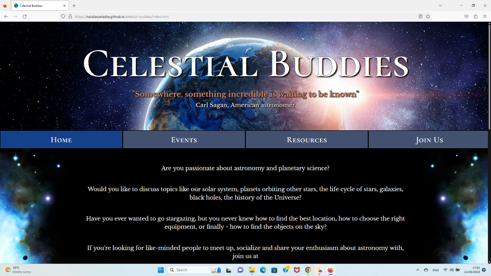 | Works as expected |
| Edge | 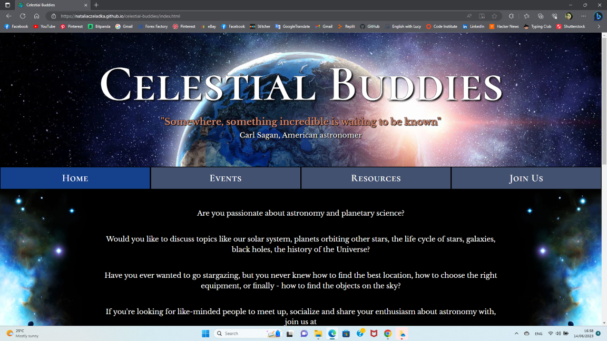 | Works as expected |
| Opera | 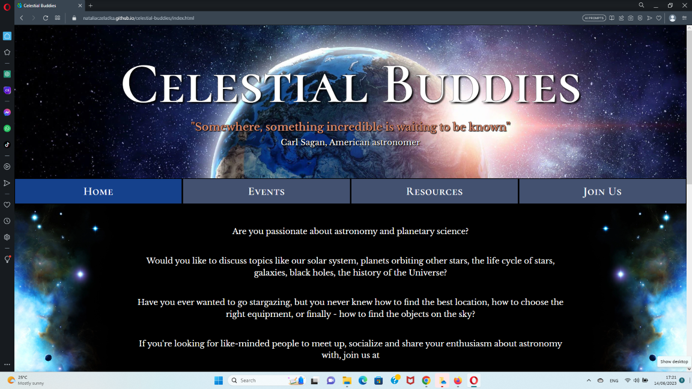 | Works as expected |

## Responsiveness

I have tested my deployed project on multiple devices to check for responsiveness issues. It responds well to different screen sizes ensuring that users can access and navigate the content effortlessly, regardless of their chosen device. No design or functionality issues found.

| Device | Screenshot | Notes |
| --- | --- | --- |
| Mobile (DevTools) | 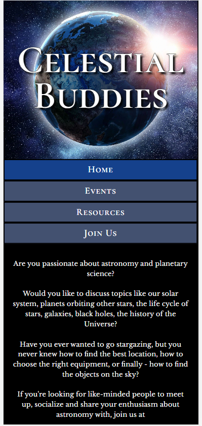 | Works as expected |
| Tablet (DevTools) | 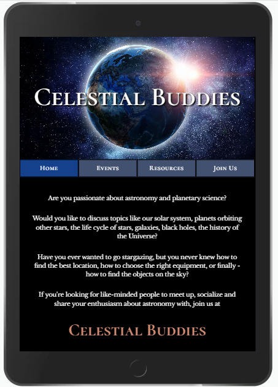 | Works as expected |
| Desktop |  | Works as expected |

## Lighthouse Audit

I have tested my deployed project using the Lighthouse Audit tool to check for any major issues. Inital scores were quite low, because the website contained images in jpeg format. For this reason, I have converted all of my jpeg image files to webp format. It has greatly improved the performance.

| Page | Size | Screenshot | Notes |
| --- | --- | --- | --- |
| Home | Mobile | 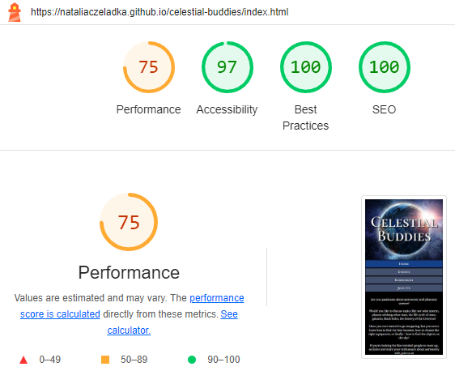 | Few warnings |
| Home | Desktop | 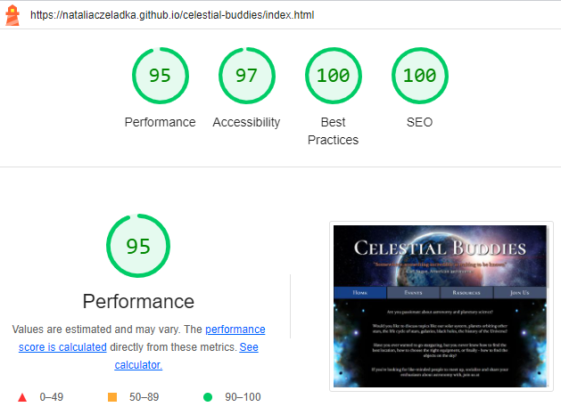 | Some minor warnings |
| Events | Mobile | 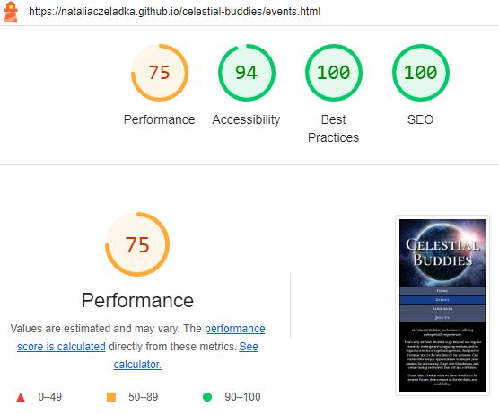 | Few warnings |
| Events | Desktop | 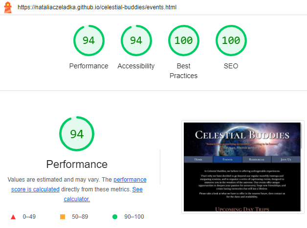 | Some minor warnings |
| Resources | Mobile | 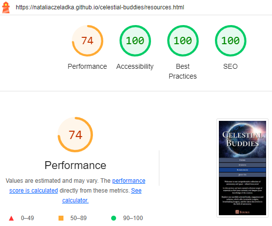 | Few warnings |
| Resources | Desktop | 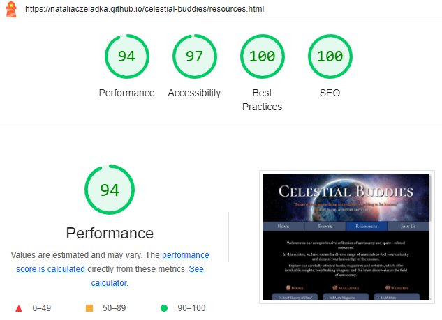 | Some minor warnings |
| Join Us | Mobile | 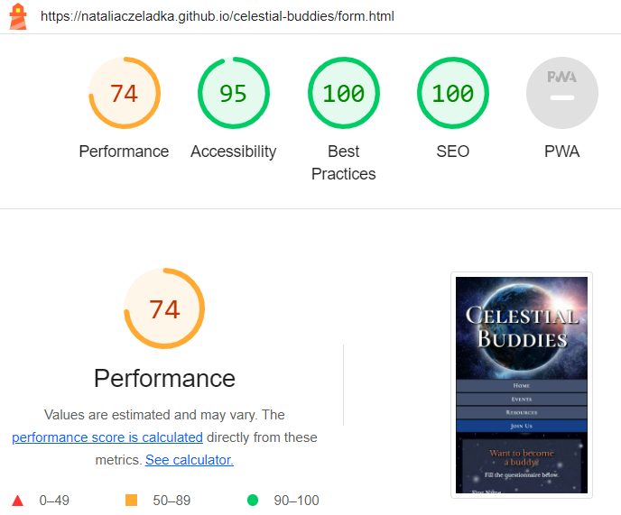 | Few warnings |
| Join Us | Desktop | 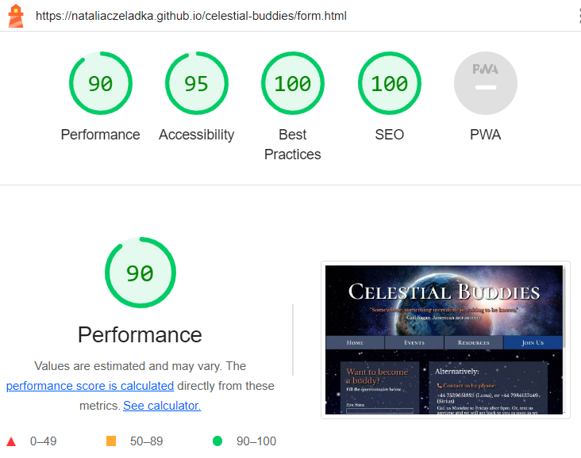 | Some minor warnings |

## User Stories Testing

### Client Goals

| User Stories | Completed? |
| --- | --- |
| As a client, I would like my astronomy club to have an online presence. | ✔️ |
| As a client, I would like to have a website that will help me create a welcoming and inclusive community, where people of all skill levels can come together to learn about the wonders of the Universe. | ✔️ |
| As a client, I would like to provide educational opportunities that attract both beginners and experienced astronomy enthusiasts through various types of activities like regular meetups, workshops, stargazing sessions, day trips etc. | ✔️ |
| As a client, I would like to inspire a passion for astronomy and space exploration by providing resources for self-study. | ✔️ |
| As a client, I would like to describe it all briefly on the website, including information about times and locations of the meetups, contact details, social media links. | ✔️ |
| As a client, I would like to attract potential members by providing it all in a form of a visually appealing, intuitive, responsive across different devices and easy to navigate website. | ✔️ |

### First Time User Goals

| User Stories | Completed? |
| --- | --- |
| As a first time user, I should be able to navigate throughout the page in an easy, effortless and intuitive way.| ✔️ |
| As a first time user, I should be able to understand the club's main purpose, its mission and values. | ✔️ |
| As a first time user, I should be able to quickly locate relevant information like learning resources, upcoming events etc. | ✔️ |
| As a first time user, I should be able to learn about various types of activities available for club's members. | ✔️ |
| As a first time user, I should be able to find the club's social media links in order to determine how trusted and known they are. | ✔️ |
| As a first time user, I should be able to sign up for a membership in a quick and easy way. | ✔️ |
| As a first time user, I should have a positive and enjoyable experience while browsing the website. | ✔️ |

### Returning User Goals

| User Stories | Completed? |
| --- | --- |
| As a returning user, I should be able to find the best way to get in contact with the club's members or to sign up.| ✔️ |
| As a returning user, I should be able to locate information about times and locations of the meetups. | ✔️ |
| As a returning user, I should be able to access their social media. | ✔️ |

### Frequent User Goals

| User Stories | Completed? |
| --- | --- |
| As a frequent user, I should be able to easily find the latest information and updates e.g., upcoming events, new learning resources. | Take a look at the Future Features section in [README.md](README.md) file |
| As a frequent user, I should be able to easily find and revisit my favourite content. | Take a look at the Future Features section in [README.md](README.md) file |
| As a frequent user, I should be able to access community and to get in touch with other members. | Take a look at the Future Features section in [README.md](README.md) file |

## Fixed Bugs

- I have initially created my header by combining the background image and the text together in the Shutterstock's editor. Then I realised that having it merged into one image will cause a lot of issues with responsiveness in the later stages of the site development and I gave up on this idea.

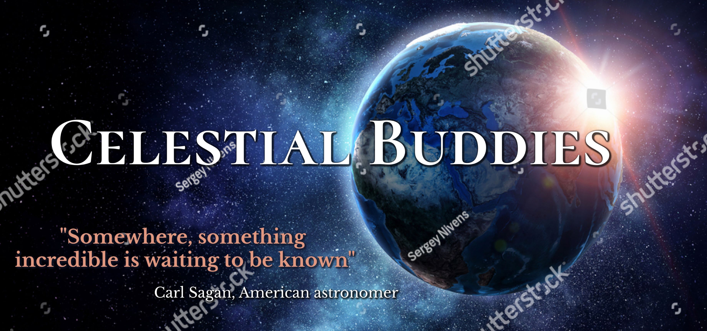

- At some point I had two `<h1>` headings in the index.html file: one in the header and one in the introduction section. The second one got changed to `<h2>`.

- I have initially written a lot of separate CSS declarations for various elements and classes changing background colour to black and font colour to white. Then I realised that it would be much easier and code efficient to replace it with one declaration for the entire body: `body {background-color: #000; Ucolor: #fff;}`

- I have assigned `class="active"` to an `<a>` instead of `<li>` in the navigation bar, what resulted in the active tab changing colour to `#15418c` only in the middle. It wasn't visible on the big screen sizes. I have noticed this bug quite late in the process, when I was trying to figure out how to make a navbar responsive on smaller devices, and I used Flexbox for this purpose.

## Unfixed Bugs

There are no remaining bugs that I am aware of.
